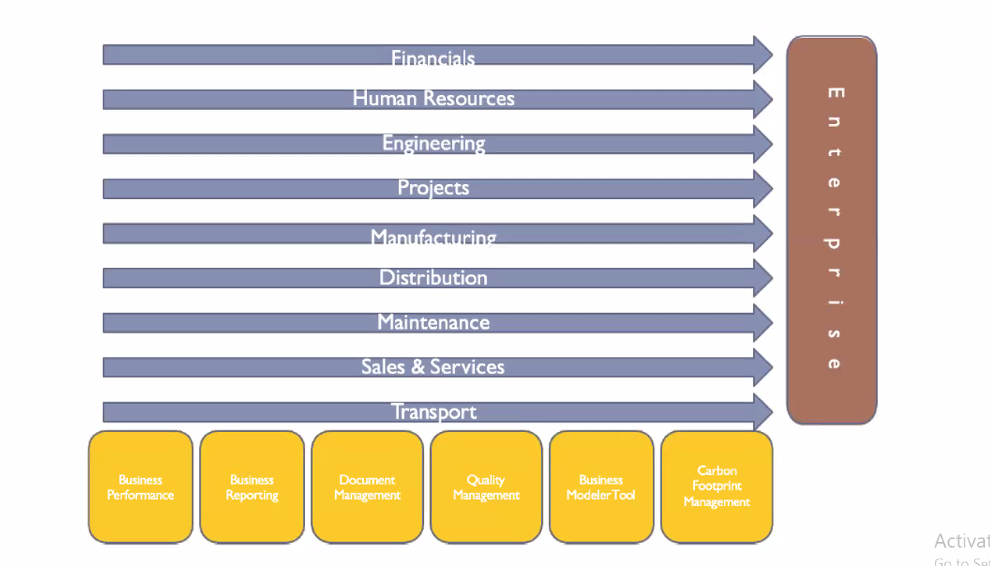

*2024-11-16*

# Introduction to Enterprise Software

## Functional Areas

Each funcitonal areas has different goals and objectives.
But all functional areas should contain all subgoals (all squares).

## Financial

Budgeting, accounting ... as goals

Enable to investigate trends and drill down to financial
transactions

- Cash flow management via customer order, purchase order
with accounts receivable and payable
- Manage Accounts
- Manage FixedAssets
- General Ledger which consider the all systems
- Budget management for forecasting
- Invoice handling automates the invoicing process for suppliers

## Human Resource

Manage company's most valuable resources cost
effectively
Self service tools to manager for HR work and employees to
manage their data and apply for new opportunities
- Support recruitment
- Training management
- Expense management which handle travel expences and
allowances
- Report time and attendance
- Payroll administration
- Employee Development and Certification to standardize the
emplovees

## Engineering

Enable to specify and configure design products and
assembly lines
- Asset Data management which manage machineries and power
grids in the plant
- Change management which helps to receive, review, checkand
approve changes

## Projects

- Handle complex project life cycles (Eg. Space Ship
manufacturing)
- Recommended for Project based manufacturing
    - Project reporting on project cost transactions
    - Sub contract management to manage sub contractors
    - Risk management to asses project risk then help to mitigate
them
    - Project planning with Gannt Display
    - Project budgeting manages the cost control

## Manufacturing

- Plan, Execute, Control andAnalyze of Manufacturing (Lean
Manufacturing)
    - Multi site planning for global customer satisfaction
    - Support Engineer to Order for customer specific design
    - Costing to identify the associated cost for the product
    - Floor reporting to report production information

## Distribution

- Identify the distribution model and working methods in
order-to-delivery chain
    - Demand planning in graphical manner for forecasting
    - Handle customer orders with pricing models
    - Handle customer in manufacturing for better delivery precision
    - Handle Supplier schedule to improve efficiency of receiving
    - inputs to the assembly line
    - purchasing for a better price
    - Handle Inventories in multisite environments

## Maintenance

- Maintain the Enterprise Assets to meet the global demand
    - Manage MRO (Maintenance, Repair and Operation)
    - Vehicle information management
    - Automation Integration with printers, barcode readers
    - Preventive maintenance for regular maintenance
    - Evaluate the equipment effectiveness to increase revenue
    - Track current equipment status to reduce the down time

## Transport

- Enables efficient and cost effective transport actives on
goods and services
    - Manage the mode of transport by air, road, train or bywater
    - Optimize the path needs to be travelled
    - Track the positions using GPS locators
    - Handle state regulations when transporting goods

 
Information integration as above

Exam Hint: What is enterprise software? What are pros and cons?

## Nature of Enterprise Software

- Lengthy Implementation (LOC (lines of code), (fu) functional units)
- Standardizing the Business Process
- Involved Risk (Bankrupt/High Profits)
- Slow Performance at the Beginning
- Total Cost of Ownership is High
- Resistance to Change at the beginning

## Key Considerations for Enterprise Applications

- Scalability: Ensure the application can handle increased workload and
data volume as your organization grows.
- Integration: Evaluate the application's ability to integrate with existing
systems, such as legacy software or third-party solutions.
- User Experience: Look for intuitive interfaces and user-friendly
features to encourage adoption and minimize training needs.
- Vendor Support: Consider the reputation, reliability, and availability of
vendor support for the application.
- Total Cost of Ownership (TCO): Assess not only the upfront costs but
also ongoing maintenance, upgrades, and licensing fees.

## Implementation Challenges

- Data Migration: Migrating existing data from legacy systems to the new
enterprise application can be complex and time-consuming.
- Change Management: Preparing and supporting employees through the
transition to a new system requires effective change management
strategies.
- Training and Adoption: Ensuring proper training and user adoption is
critical for maximizing the benefits of enterprise applications.
- Business Process Alignment: Aligning the application with existing business
processes may require customization or process reengineering.
- Security and Compliance: Addressing security concerns and complying with
industry regulations are essential during implementation.

## Future Trends in Enterprise Applications

- Artificial Intelligence (Al) Integration: Al-powered capabilities like predictive
analytics and chatbots will enhance automation and decision-making.
- Cloud Computing: Increasing adoption of cloud-based enterprise
applications for improved scalability, flexibility, and cost-effectiveness.
- Internet of Things (IoT): Integration of loT devices and sensors to gather
real-time data and automate processes within enterprise applications.
- Low-Code Development: Simplified development tools that enable
organizations to create custom enterprise applications with minimal
coding.
- Mobile-First Approach: Mobile-friendly interfaces and applications
designed for seamless access and productivity on smartphones and tablets.

## Commercial Enterprise Resource Planners (ERPs)

- SAP - www.sap.com
- Infor - www.infor.com
- Oracle - JD Edward, E-business suit,PeopleSoft www.oracle.com
- IFS - www.ifsworld.com
- Microsoft Dynamics - www.microsoft.com/dynamics
- Compiere - www.compiere.org
- Sage Group - www.sagenorthamerica.com

## Types of Enterprise Applications

1. Enterprise Resource Planning (ERP): Integrates core business processes
like finance, human resources, supply chain, and customer relationship
management.
2. Customer Relationship Management (CRM): Manages customer
interactions, sales, marketing, and customer service.
3. Supply Chain Management (SCM): Handles procurement, inventory,
logistics, and demand forecasting.
4. Business Intelligence (BI): Collects, analyzes, and presents data to
support decision-making.
5. Enterprise Content Management (ECM): Organizes, stores, and manages
documents and content across the organization.

## Real-Life Examples of Enterprise Applications

1. SAP ERP: A widely used enterprise application that integrates various
business functions, including finance, logistics, and human resources.
2. Salesforce CRM: A cloud-based CRM solution that helps organizations
manage customer relationships, sales, and marketing activities.
3. Oracle SCM: A comprehensive supply chain management application that
optimizes procurement, inventory, and distribution operations.
4. Tableau BI: A powerful business intelligence tool that allows businesses
to visualize and analyze data for decision-making.
5. SharePoint ECM: Microsoft's enterprise content management platform
for storing, organizing, and collaborating on documents and content.
Activate Windows