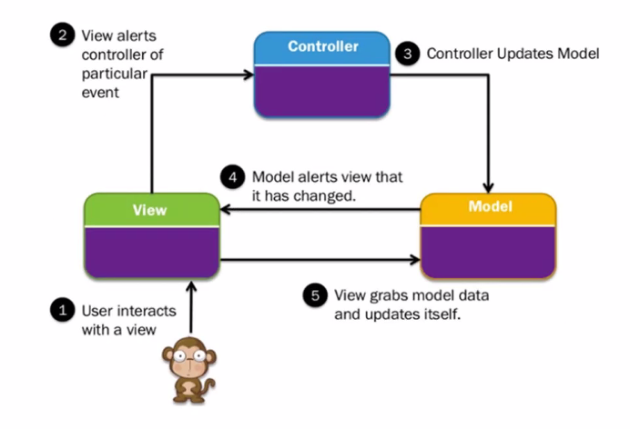

*2024-11-20*

# Introduction To Architecture

  

## Enterprise Architecture

## Definitions

- Enterprise Architecture is about understanding all of the
different elements that go to make up the enterprise and
how those elements interrelate. [The Open Group]

- Enterprise Architecture is a strategic information asset
base, which defines the business mission, the information
necessary to perform the mission, and the transitional
processes for implementing new technologies in response
to the changing mission needs. [USA Federal CIO Council]

## Logical Components of an Enterprise Architecture

### Without Architectures

- Unpredictable Solutions
- Poor Quality and Reduced User Experience
- Stunted Evolution
- Rigid Systems (hard to reuse)

(Above can be exam)

## Types of architectures

- Layered Architecture
- MVC Architecture
- Component Based Architecture

### Layered Architecture

Started with Client/Server
- Thin Client - Web clients [Google Docs/Photo
Editor web]
- Fat Client - Window Clients [Word
Document/Photo Editor/Desktop]

#### Evolution
- Two Tier - User Interface and Database
- Three Tier - UI, Business Logic Layer, Database

#### Multilayer Architecture
- Presentation layer (UI layer/View layer/Presentation layer)
- Business Logic Layer(Business Layer)
- Application layer (Service Layer)
- Data Access Layer (Persistence Layer)

## Model, View and Controller (MVC) Architecture

- Model - A model represents an application's data and contains the logic for
accessing and manipulating that data

- View - The presentation semantics are encapsulated within the view

- Controller - The controller is responsible for intercepting and translating user
input into actions to be performed by the model

### Web Browser and Web Page example

- Model - Encapsulate data in the database.
- View - Presentation layer, web pages, CSS, Java Script
- Controller - Process and respond to events

