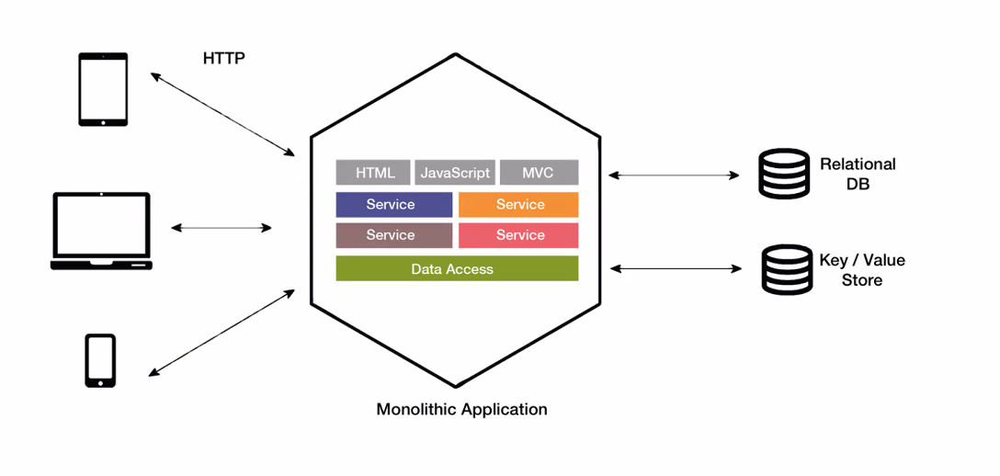

*2024-12-02*

# Component Based Architecture

## Component Based Architecture

Why Component architecture ?

- Enterprise Applications Involved high complexity
- Adopt new functionality in low cost manner
- Easier for new customers to implement
- Existing customer should be able to upgrade to new functionality

## What is Component

Individual module which has following attributes

- Separation - All data and Functions are semantically related
- Interfacing - Which can upgrade with new components
- Standardization - Agreed standard interface

Example: PC
- Constructed by different manufacturers
- Assembled very rapidly
- Assembler is not an expert in internals of each component

## Disadvantages of Component Based

- Performance overhead
- Difficult to change interfaces 

## Component Based Architecture Goals

- Goal 01: Software Construction

- Goal 02: Reuse

- Goal 03: Maintanance

Exam: Compare major benefits or drawbacks between different architecture patterns.

# Monolithic Architecture

- A Monolithic Architecture is a software pattern in which a
single application is built as a single, indivisible unit.
- All components of the application are interconnected and
run as a single process.

    - Single Codebase: All functionality exists in a single codebase.
    - Unified Deployment: The application is deployed as a single
unit.
    - Tight Coupling: Components are tightly coupled and
interdependent.
    - Single Process: Runs as a single process on a server.

- A monolithic architecture is a traditional approach where the entire
application is a single, integrated unit.
- As the application grows, complexity increases, making maintenance and scaling difficult.
    - Limited Scalability: All components must scale together, leading to inefficiencies.

## Benefits

- Simpler development and deployment: Initial development simplicity due
to single codebase. Easy to deploy and manage in smaller environments.
- Less Overhead: Fewer cross-service communication and management
complexities.
- Better performance: Monolithic apps, in turn, allow faster communication
between software components due to shared code and memory
- Integrated Development Environment: Easier to work within a single IDE.

## Drawbacks

- Scalability: Difficult to scale specific parts of the application independently.
- Maintainability: Large codebase can become difficult to maintain overtime.
- Deployment: A small change requires redeployment of the entire
application.
- Reliability: A bug in any part of the application can affect the entire system.
- Difficult to adopt new technologies: Adding new technology means rewriting the whole application.
- Limited agility: When several teams are working on the same project, agility can be reduced greatly.

## Use Cases

- Legacy Systems: Many older systems use monolithic architecture due to its simplicity.
- Small Applications: Suitable for small applications or startups with limited functionality.

# Service Oriented Architecture

Service-Oriented Architecture (SOA) is a software architectural style which provides services to other components via a communications protocol like HTTP or SOAP (Simple Object Access Protocol)., typically over a network.

## Evolution of SOA

- Loosely coupled architecture
- Designed to achieve the business needs
- Contains OO, Components and service message passing in between them
- Agile friendly

- A design pattern where services are provided to other components by application components, through a communication protocol over a network.
- Purpose is to allow different services to communicate with each other and be reused independently.

**SOA can involve more than one databases but a specific service is not tied to an specific database**

Esb vs Queues?

## SOA Benefits

## SOA Components

Exam Q) What are the components of SOA