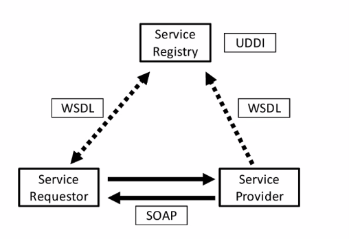
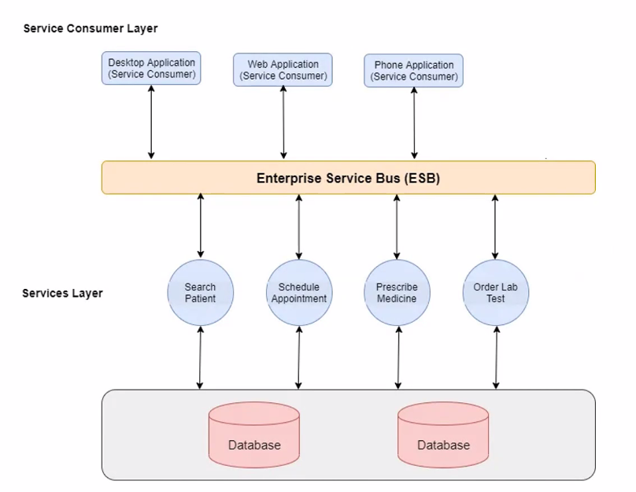
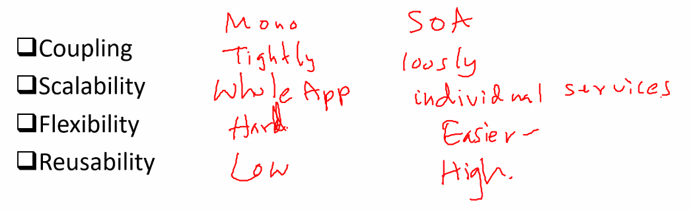
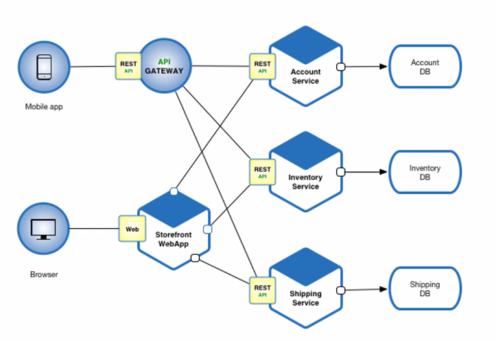
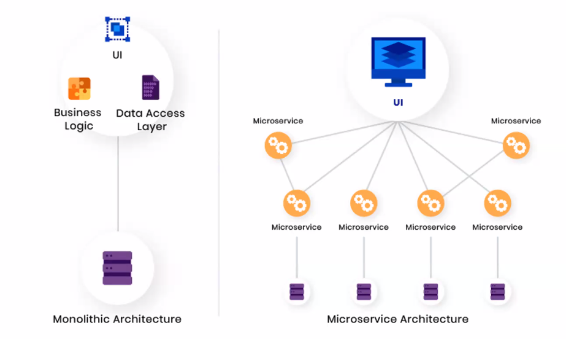
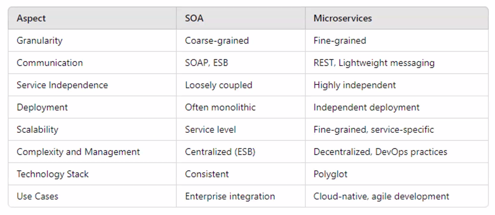

*2024-12-04*

## Can a service provider also act as a service consumer?

Customer
- |

**Order Service (acts as both consumer and provider)**
- | --- > [Check Inventory] -- > Inventory Service (provider)
- |
- | --- > [Process Payment] -- > Payment Service (provider)
- |
- | --- > [Send Notification] -- > Notification Service (provider)

## SOA Technologies

### SOAP (Simple Object Access Protocol)

A protocol for structured information exchange in web services, using XML. SOAP messages can be transported over a variety of protocols, including HTTP, SMTP, TCP, and more.

### ESB (Enterprise Service Bus)

A middleware architecture for facilitating service communication
and integration in SOA.

### WSDL (Web Services Description Language)

An XML-based language for describing web service
functionalities.

### UDDI (Universal Description, Discovery, and Integration)

A directory service for publishing and
discovering web services.

## Service-oriented architecture Benefits

- Reusability of services: improve efficiency.
- Scalability: Easily scale services independently
- Flexibility and Agility: Easier to update and maintain specific services.
- Maintainability: Decoupled services are easier to debug and test.
- Parallel development: Independent services can be developed in
parallel and completed at the same time.
- Cost Reduction: Reduced development and maintenance costs due to reusable services.

## Exercise 01

Imagine you have an IT department tasked with developing software for a clinic.
This software needs to enable doctors to search for patients, schedule
appointments, prescribe medications, and send lab test orders. Due to business
requirements, you need to create three separate applications: a desktop
application, a web application, and a mobile application. Instead of writing the
business logic for each feature three times for each application, you would develop
services or web services for each feature: patient search, appointment scheduling,
prescription writing, and lab test ordering. These services would be hosted in a
centralized location, allowing different application developers to find and use them
in their respective applications. As a result, you only write the services once, and all
other applications use them. The server consumers communicate with these
services through an Enterprise Service Bus (ESB). Draw the software solution
architecture for the above system.

### Excercise 02

Compare SOA and Monolithic Architecture under following features:

- Coupling
- Scalability
- Flexibility
- Reusability

# Microservices Architecture

Microservices are a software architectural style that structures an application as a collection of loosely coupled, independently deployable services.

-  The microservices approach has become a trend in recent years as more and more enterprises become agile.
- Characteristics:
    - Small, focused on a single business capability.
    - Decentralized data management.
    - Independent deployment and scaling

## Microservices vs Monolithic

## Benefits 

- Scalability: Services can be scaled independently.
- Flexibility: Different technologies can be used for different services.
- Resilience: Failure of one service doesn't impact the entire system.
- Development Speed: Teams can develop, deploy, and scale services independently.
- Increased agility: several teams can work on their services
independently and quickly.

## Drawbacks:

-  Complexity:
1. Increased demand for automation, as every service should be tested and
monitored
2. Available tools don't work with service dependencies
3. Data consistency and transaction management becomes harder as each
service has a database

- Security concerns: each functionality that communicates externally via an API increases the chance of attacks.
- Network Latency: Increased communication over the network can
introduce latency.

## Example Microservice Stack

- Frontend: React, Angular, Vue.js
- Backend Services: Spring Boot, Node.js, Express
- Database: MongoDB, PostgreSQL
- API Gateway: NGINX, Kong
- Communication Protocols: HTTP/REST and gRPCData
- Monitoring: Prometheus, Grafana
- Containers and Orchestration: Docker and Kubernetes
- CI/CD Tools: Jenkins

Exam? API Gateway and Communication protocols.

