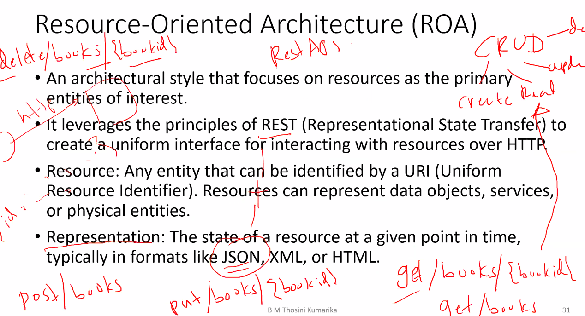

*2024-12-09*

# ROA

# Domain-Driven Design (DDD)

Domain-Driven Design (DDD) is an approach to software development that emphasizes the importance of modeling the domain (business logic) and building a deep understanding of the domain's complexities.

**Benefits:**

- Improved alignment between the business and the software model.
- Enhanced maintainability and scalability through well-defined boundaries and models.
- Better handling of complex business rules and processes.

**Use Cases:**

- Complex business applications with intricate domain logic.
- Systems where deep collaboration between technical and domain experts is essential.

## Are all Enterprise solutions DDD?

1. Complex Enterprise System: A large e-commerce platform with intricate
pricing rules, inventory management, and customer personalization
which need to manage the complex interactions and business logic. (DD)
2. Simple CRUD Application: A basic employee management system that
requires simple Create, Read, Update, Delete (CRUD) operations on
employee records. (Monolithic mvc/layered)
3. Real-Time Data Processing : An application that processes streaming data
from loT devices in real-time which requires handling the continuous
flow of data and trigger responses. (event driven)
4. Integrating Legacy Systems : A banking application that needs to
integrate various legacy systems for customer account management and
also to facilitate communication between the different systems. (SOA)

# Event-Driven Architecture (EDA)

- Event-Driven Architecture (EDA) is an architectural style in which
events are the primary means of communication between decoupled components.
- An event signifies a significant change in state or an occurrence that components react to.
- Use Cases:
    - Real-time analytics and monitoring systems.
    - Applications requiring decoupled and scalable communication, such as e-commerce platforms and loT systems.

## Event-Driven Architecture (EDA) - Key Concepts

- **Event**: A signal that something of interest has happened, such as a state change or a user action. Events can carry data about the occurrence.
- **Event Producer**: A component that generates and publishes events.
- **Event Consumer**: A component that subscribes to and reacts to events.
- **Event Channel**: The medium through which events are transmitted from producers to consumers, often implemented using message brokers or event buses.

(Order service and shipping service)

## Example Scenarios:

1. A large-scale online travel booking platform.
- The platform needs to handle various services like flight bookings, hotel
reservations, car rentals, and user reviews.
- Each service needs to be independently scalable to handle high traffic and
frequent updates.
- The platform must integrate with multiple third-party APIs and support real-
time availability and pricing updates.
2. A local restaurant's online ordering system.
- The system needs to provide a simple interface for customers to browse the
menu, place orders, and make payments.
- The development team is small, and the restaurant wants to quickly deploy
the system with minimal complexity.
- The volume of traffic is relatively low and manageable within a single
codebase.