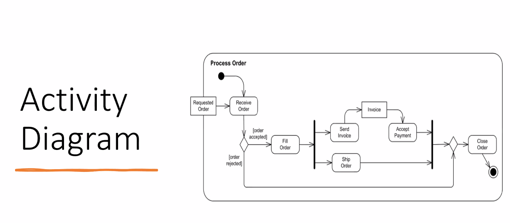

*2024-12-11*

# Software Decomposition

## Key Aspects

1. Modularity: Dividing the system into distinct modules, each responsible for a specific aspect of functionality.
2. Abstraction: Simplifying complex systems by abstracting details and focusing on higher-level constructs.
3. Encapsulation: Ensuring that a module's internal details are hidden from other modules.
4. Cohesion: refers to the degree to which elements within a module belong together.
5. Coupling: refers to the degree of interdependence between modules.

## Techniques for Decomposition

1. Functional Decomposition: Breaking down the system based on functionality.
2. Layered Architecture: Dividing the system into layers with specific roles.
3. Service-Oriented Architecture (SOA): Decomposing the system into services providing distinct business capabilities.
4. Microservices Architecture: Further breaking down services into smaller, independently deployable units.
5. Component-Based Architecture: Organizing the system into reusable components with well-defined interfaces.
6. Domain-Driven Design (DDD): Decomposing based on business domains and subdomains.

## Views vs Decomposition

## Views vs Decomposition

- Decomposition provides the structural foundation, breaking down the system into manageable components.
- Views describe, illustrate, and validate this decomposed structure from various perspectives, ensuring that all stakeholder concerns are
addressed and that the system is well-understood and documented.

## Representing Views (Available notations)

- Traditionally views were used for conditions
    - Graphical representation
    - Tabular representation
- Other popular views
    - 4+1 Rational Unified Process ( RUP)
    - Siemen's 4 view

### Rational Unified Process (RUP) View ( Kruchten 4+1)
- 4 main views of a SW + 1 view tying them together
- 4 Main views
    - Logical View
    - Process View
    - Deployment View
    - Implementation View ( development)
- 1 connecting view
    - Selected use cases or scenarios

## 4+1 Architectural view model

- By Philippe Kruchten - Canadian software engineer,
- Philippe Kruchten has more than 16 years of experience as a leader of the development team in Rational corporation.
- He had a good experiences in industry (Telecom, Air traffic control system) which he used to justify his model.
- Professor of Software Eregineering at University of British Columbia in Vancouver, Canada.

## Problem

- Arch. documents over-emphasize an aspect of development or
do not address the concerns of all stakeholders
- Various stakeholders of software system:
    - end-users
    - developers,
    - system engineers,
    - project managers
- Software engineers struggled to represent more on one blueprint, and so arch. documents contain complex diagrams

## Solution

- Using several concurrent views or perspectives, with different notations each one addressing one specific set for concerns.
- "4+1" view model presented to address large and challenging architectures.

## 4+1 architectural view model

- Logical View and the Process View are at a Conceptual level
    - Used from analysis to design.
- The Implementation View and the Deployment View are at the Physical level
    - Used represent the actual application components built and deployed.

## Logical view

- (Object-oriented Decomposition)
- Logical Architects use this view for functional analysis
- UML diagrams used to represent the logical view include, class diagrams, sequence diagrams, state diagrams etc.
- Viewer: End-user,
- considers: Functional requirements-What the system should provide in terms of services to its users.

Example view, 

## UML (Unified Modeling Language)

- The 4 + 1 views are a generic approach that does not prescribe any specific notation or diagramming structure (although Booch notation is used in the paper).
- An alternative approach to talk about software, which resulted in the Unified Modeling Language Framework was also introduced.
- UML is a standard notation for the modeling of real-world objects as a first step in developing an object-oriented design methodology .

## List of online tools to create diagrams

- draw.io
- gliffy
- cacoo
- processon
- lucidchart
- diagramo
- creately

## Process View

- (The process decomposition)
- Viewer: Integrators
- Considers: Non -functional requirements
- This view considers non-functional aspects such as
- performance,
- Concurrency,
- scalability
- A process is a grouping of tasks that form an executable unit.
- To understand the organization processes, the process architectural view is used in the Analysis and Design.

Can use statecharts/sequential

## Process View

- The process view allows you to show
- what the system does at a high level, and
- how the smaller steps withinthe process fit together.
- It clears the processes steps, order and flow of information.
- The major flows of information through the system well understood and documented.#

## Development View

- (Subsystem decomposition)
- Viewer: Programmers and Software Managers
- Considers: software module organization
(Hierarchy of layers, software management, reuse, constraints of tools)
- Focuses on configuration management and actual software module organization.
- Component Diagrams are used to represent the Development View (Also package diagrams)
- These diagrams show different components, the ports available and the dependencies on the environment in terms of provided and required interfaces.

The implementation view is useful for:

- assigning implementation work to individuals and teams, or
subcontractors
- assessing the amount of code to be developed, modified, or deleted reasoning large-scale reuse
- considering release strategies

## Physical View ( deployment)

- (Mapping the software to the Hardware)
- Viewer: System Engineers
- Considers: Non-functional req- regarding to underlying hardware
(Topology, Communication)
- Understanding the physical distribution of the system across a set of
processing nodes.
- The distribution of processing across a set of nodes in the system,
including the physical distribution of processes and threads.

(Exam: Class diagram or sequencial diagram or activity diagram)

## View Vs. Notation

