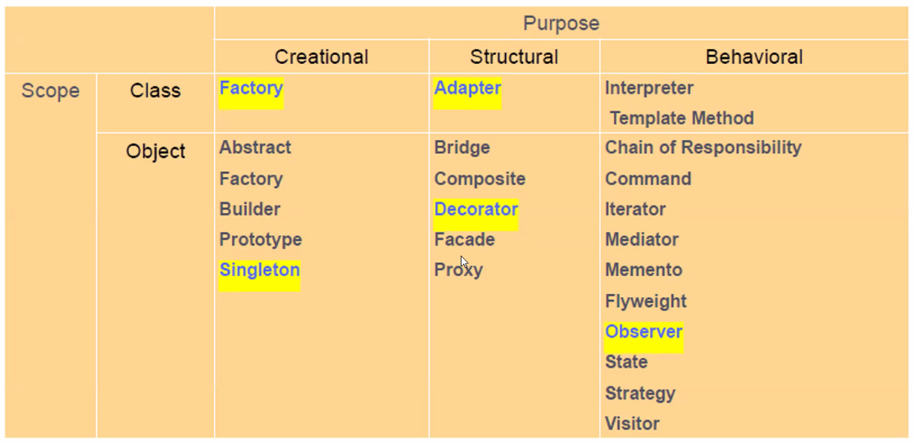

*2024-12-18*

# Design Patterns

## Introduction

- Why?
    - Design patterns make it easier to reuse successful **designs and Architectures**

- Design Pattern -> Right Design (Faster)
- Make Novice an Expert
- "Each pattern describe a problem which occurs over and over again in our
environment, and then describe the core of the solution to that problem, in
such a way that you can use this solution a million times over, without ever
doing it the same way twice" [Christopher Alexander]

## Advantages of Design Patterns

- They are reusable in multiple projects.
- They capture the software engineering experiences.
- They provide transparency to the design of an application.
- They are well-proved and testified solutions since they have been built upon
the knowledge and experience of expert software developers.
- Design patterns don't guarantee an absolute solution to a problem. They provide clarity to the system architecture and the possibility of building a better system.

## Design Patten Space

Grouping based on Two Criteria

> Purpose - What pattern does

- **Creational** : Process of Object creation
- **Structural** : Composition of Classes or Objects
- **Behavioral** : Classes or Objects interact and distribute responsibility

> Scope - Whether the pattern applied primarily to a Class or an Object 

- **Class** - Deals with relationships between classes and sub-classes (Via inheritance and static)
- **Object** - Deals with object relationships (can be changed at runtime and dynamic)

## Singleton 

- Use Encapsulation (What is Encapsulation ?)
- Is used when only one instance of an object is needed throughout the
lifetime of an application
- How
    - Make the class responsible for keeping track of its sole instance (users cannot explicitly instantiate this class)
    - Provide a global way to access the instance
- Client access singleton instance only via `SingletonOperation()`

## Key Concepts:

1. Private Constructor: The Singleton class has a private constructor, preventing direct instantiation of the object from outside the class.
2. Private Static Instance: The Singleton class contains a private static instance of itself. This instance is typically created and initialized only once, lazily or eagerly depending on the implementation.
3. Static Method for Access: It provides a static method (often named getInstance()) that allows clients to access the single instance of the class. This method ensures that only one instance is created and provides a global point of access to that instance.

## Benefits of Singleton Pattern

- Controlled Access: Ensures that there is only one instance of the class, providing a single point of access to that instance.
- Memory Efficiency: Prevents multiple instances from being created, which can be beneficial in memory-constrained environments.
- Global Point of Access: Facilitates centralized access to resources or shared objects.

## Example for Singleton Pattern Usage

- Singleton - Examples:
    - Clip board
    - Windows registry (System parameters)

## Exercise

- You are a developer at Microsoft who is responsible to develop the "Windows Clipboard" for their next operating system. Windows Clipboard is used to share (copy/paste) data between different instances of the same application or between different application instances. Design  requirement is to have only one instance of the
windows clipboard class at any given point of time while thousands of other application instances utilizing the one and only clipboard instance to share data between them.

- Implement a sample windows clipboard class.